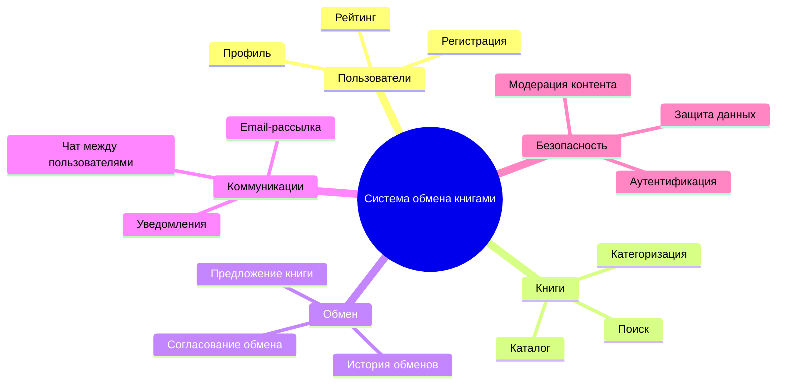
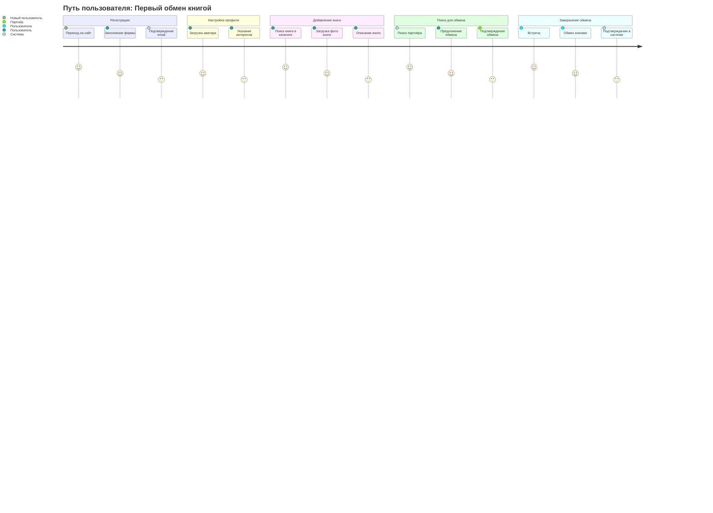
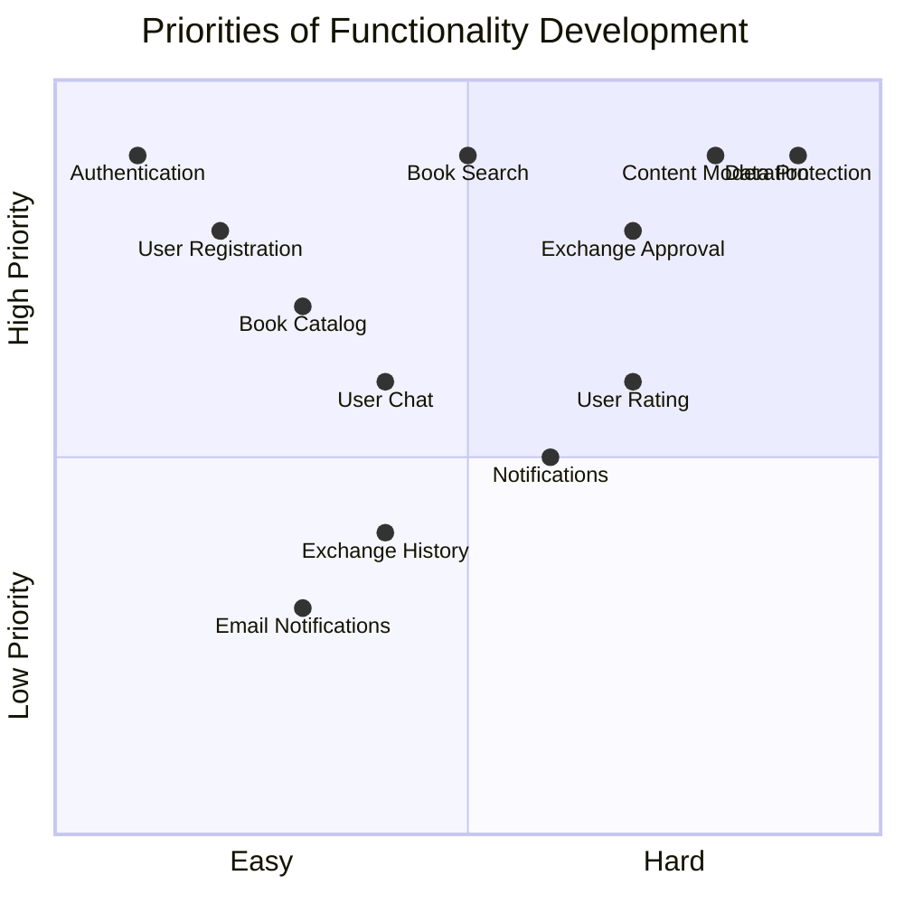
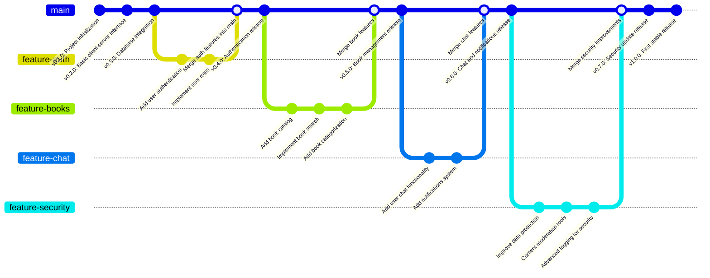

# Документирование системы обмена книгами

## 1. Структура функциональных возможностей (Mind Map)

### Описание:
Эта диаграмма иллюстрирует структуру функциональных возможностей системы обмена книгами. 
### Основные узлы и их значение:

* <u>Пользователи:</u> функционал, связанный с управлением учетными записями, профилями и рейтингами.
* <u>Книги:</u> функционал работы с каталогами, поиском и категоризацией книг.
* <u>Обмен:</u> процесс обмена книгами, включающий предложения, согласования и историю операций.
* <u>Коммуникации:</u> система взаимодействия между пользователями (чаты, уведомления).
* <u>Безопасность:</u> меры по защите данных, аутентификации и модерации контента.

## 2. Диаграмма путешествия пользователя (User Journey Diagram)

### Описание:
Диаграмма описывает ключевые этапы взаимодействия пользователя с системой:

* Регистрация: пользователь создает учетную запись и настраивает свой профиль.
* Поиск книг: пользователь просматривает каталог, использует поиск и фильтры для выбора книги.
* Обмен книгами: пользователь предлагает свою книгу, согласовывает сделку с другим участником.
* Коммуникация: пользователь использует чат для уточнения деталей и оставляет отзыв о партнере по обмену.

## 3. Квадрант-граф (Prioritization Quadrant)

### Описание:
Квадрант-граф помогает приоритизировать разработку функций системы. Каждая точка соответствует функционалу:

* Ось X: сложность реализации (от простого к сложному).
* Ось Y: приоритет для пользователей (от низкого к высокому).

## 4. Гит граф (Gitgraph)

### Описание:
 Гит-граф показывает процесс разработки системы через версии:
1. Основная ветка (main): стабильные версии системы.
2. Функциональные ветки: каждая ветка посвящена отдельной функциональности (пользователи, книги, обмен).
3. Слияния: после завершения работы над веткой, изменения интегрируются в main.